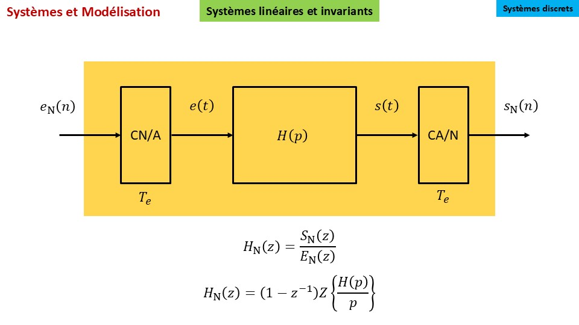

# Modélisation numérique

## Introduction

On se propose de détailler sur un exemple les  étapes suivies pour accéder à la fonction de transfert $H_N(z)$ modélisant l'ensemble encadré en jaune dans le schéma ci-dessous.



Le convertisseur numérique analogique (CN/A) est un bloqueur d'ordre zéro (_zero order hold_), de sorte que $e(t)=e_N(n)$ pour $nT_e \leq t \lt (n+1)T_e$.

Le convertisseur analogique numérique (CA/N) délivre un signal numérique $s_N(n)=s(nT_e)$.

## Exemple choisi

Les étapes vont être détaillées avec la fonction de transfert ci-dessous.

$$H(p)=\\frac{K}{p \\left(p \\tau + 1\\right)}$$

## Réponse incicielle associée à $H(p)$

Via le package sympy, on accède à la réponse indicielle $r(t)$.

```python
import sympy as sp
p, zm1, K, tau, t, n, T_e=sp.symbols('p, z^{-1}, K, tau, t, n, T_e')
H = K/(p*(1+tau*p))
r = sp.inverse_laplace_transform(H/p,p,t)
```

$$r(t)=K \\left(t \\theta\\left(t\\right) - \\tau \\theta\\left(t\\right) + \\tau e^{- \\frac{t}{\\tau}} \\theta\\left(t\\right)\\right)$$

## Echantillonnage de la réponse indicielle

$$r_N(n) = K \\left(T_{e} n \\theta\\left(T_{e} n\\right) - \\tau \\theta\\left(T_{e} n\\right) + \\tau e^{- \\frac{T_{e} n}{\\tau}} \\theta\\left(T_{e} n\\right)\\right)$$

## Transformée en z de cette réponse

$$R_N(z)=\\frac{K T_{e} z^{-1}}{\\left(1 - z^{-1}\\right)^{2}} + \\frac{K \\tau}{- z^{-1} e^{- \\frac{T_{e}}{\\tau}} + 1} - \\frac{K \\tau}{1 - z^{-1}}$$


